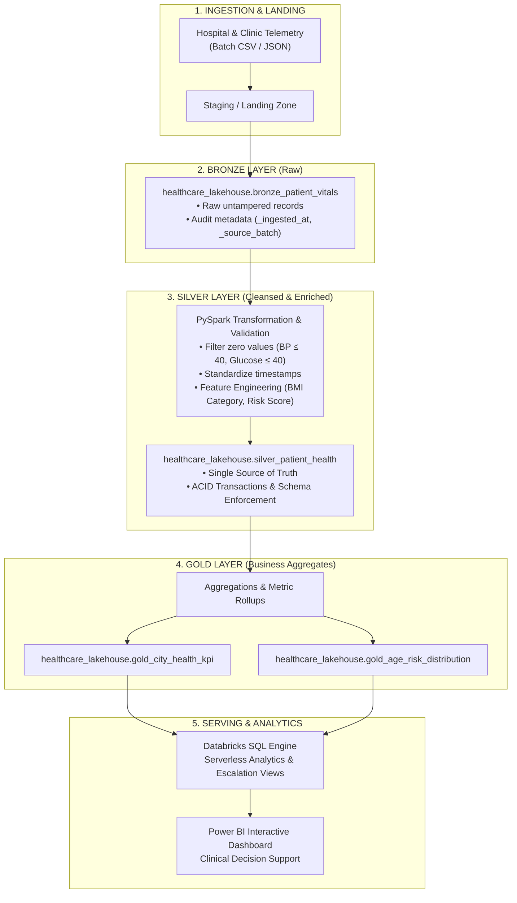
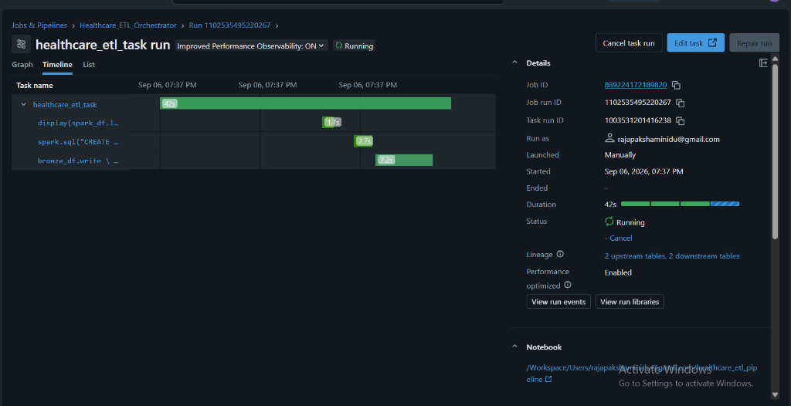
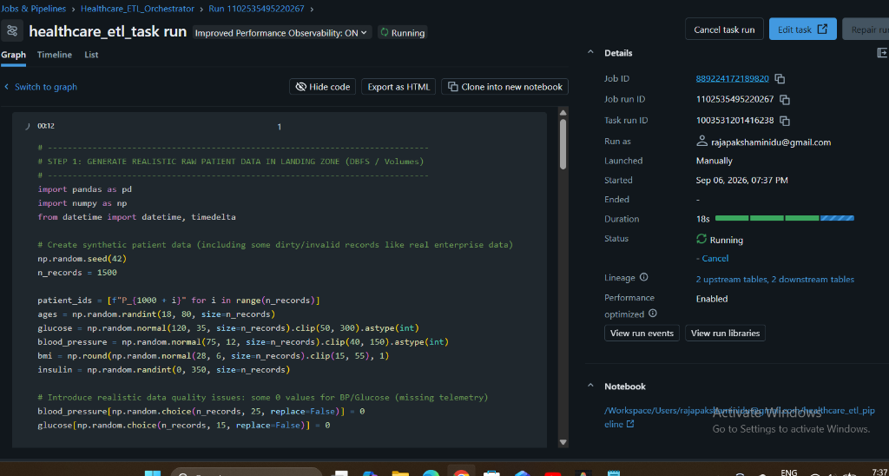
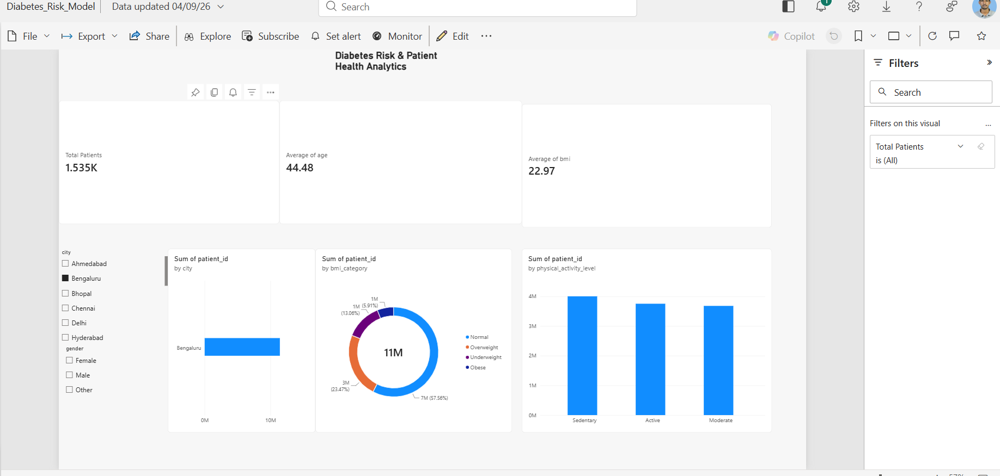

# 🏥 Automated Healthcare Patient Lakehouse ETL Pipeline
### Production-Grade Medallion Architecture with Databricks, PySpark, Delta Lake, Databricks Workflows, and SQL


---

## 📌 Executive Summary

Modern clinical decision-support systems require reliable, automated data pipelines to ingest messy, continuous telemetry from outpatient clinics, lab results, and wearable monitors. 

This project implements an end-to-end **Medallion Architecture (Bronze ➔ Silver ➔ Gold)** in **Databricks** using **PySpark** and **Delta Lake**. The pipeline automates the ingestion of raw patient vitals, enforces data quality constraints, enriches clinical records with risk scores, pre-computes operational KPIs in Delta format, and serves them to **Databricks SQL** and downstream **Power BI** dashboards.

> 🔗 **Downstream Consumption Layer**: The analytical tables engineered by this pipeline power the [Diabetes Risk & Patient Health Power BI Dashboard](https://github.com/Rajapakshaminindu/diabetes-risk-powerbi-analysis).

---

## 🏗️ Architecture & Data Flow



---

## 🔄 Automated Orchestration (Databricks Workflows)

The pipeline is automated and monitored via **Databricks Workflows (Jobs)** (`Healthcare_ETL_Orchestrator`), featuring automated task scheduling, lineage tracking, and retry policies.

### ⏱️ Task Timeline & Lineage Observability
Real-time monitoring graph demonstrating execution duration, stage timing, and automatic discovery of **2 upstream and 2 downstream Delta tables**:



### ⚙️ Step-by-Step Distributed Execution
Live orchestration view executing the PySpark data quality checks, schema evolution, and Delta Lake writes:



---

## 🛠️ Tech Stack & Engineering Concepts

| Area | Technologies / Concepts |
| :--- | :--- |
| **Compute & Processing** | Databricks Runtime, Apache Spark, PySpark DataFrame API |
| **Storage & Lakehouse** | Delta Lake (Parquet + Delta Transaction Log), ACID transactions |
| **Data Architecture** | Medallion Architecture (Bronze $\rightarrow$ Silver $\rightarrow$ Gold) |
| **Orchestration & Ops** | Databricks Workflows (Jobs), scheduled cron triggers, automated retry policies |
| **Serving & Modeling** | Databricks SQL, Star-schema rollups, T-SQL views, Time Travel audits |

---

## 📂 Repository Structure

```text
├── README.md                              <- Project overview & architecture documentation
├── .gitignore                             <- Git ignore rules for Python / Databricks
├── docs/
│   └── images/                            <- Pipeline execution & dashboard screenshots
├── notebooks/
│   └── healthcare_etl_pipeline.py         <- Production PySpark ETL pipeline script
├── sql/
│   └── gold_analytics_queries.sql         <- Analytical SQL queries & clinical escalation views
└── data/
    └── sample_patient_vitals.csv          <- Sample batch of incoming patient telemetry
```

---

## ⚙️ Pipeline Implementation Details

### 1. Bronze Layer (Append-Only Raw Data)
* Ingests raw data without destructive transformations to preserve the historical audit trail.
* Appends lineage metadata:
  * `_ingested_at`: UTC timestamp of pipeline ingestion.
  * `_source_batch`: Batch identifier for backfill and incremental traceability.

### 2. Silver Layer (Data Cleansing & Business Logic)
* **Data Quality Filters**: Identifies medically anomalous readings (e.g., Blood Pressure $\le 40$ or Glucose $\le 40$ caused by sensor dropouts) and cleans them to `NULL` to avoid corrupting statistical models.
* **Feature Engineering**:
  * `bmi_category`: Segmented into *Underweight*, *Normal*, *Overweight*, and *Obese* (WHO clinical standards).
  * `diabetes_risk_score`: Categorized into *High Risk*, *Moderate Risk*, and *Low Risk* based on composite glucose and BMI thresholds.
  * `age_bracket`: Stratified into demographic cohorts (`18-29`, `30-49`, `50-64`, `65+`).
* **Delta ACID Guarantees**: Written using `.option("mergeSchema", "true")` ensuring controlled schema evolution.

### 3. Gold Layer (Dimensional Aggregates)
* Pre-calculates high-value KPIs for instant retrieval:
  * **`gold_city_health_kpi`**: Patient counts, average glucose, blood pressure, BMI, and percentage of high-risk patients grouped by municipality.
  * **`gold_age_risk_distribution`**: Matrix of risk levels across age cohorts for targeted healthcare interventions.

---

## 🕒 Delta Lake Time Travel & Auditability

Delta Lake maintains an append-only transaction log (`_delta_log`), enabling auditing and historical time-travel:

```sql
-- Inspect the audit log of operations (WRITE, MERGE, OPTIMIZE)
DESCRIBE HISTORY healthcare_lakehouse.silver_patient_health;

-- Query snapshot state as of version 0
SELECT * FROM healthcare_lakehouse.silver_patient_health VERSION AS OF 0;
```

---

## 📊 Analytical SQL Queries

```sql
SELECT 
    city,
    total_patients,
    avg_glucose,
    avg_bmi,
    high_risk_percentage,
    DENSE_RANK() OVER (ORDER BY high_risk_percentage DESC) AS risk_rank
FROM 
    healthcare_lakehouse.gold_city_health_kpi
ORDER BY 
    risk_rank ASC;
```

---

## 📈 Downstream Analytics: Power BI Clinical Dashboard

The Gold layer tables are served directly to the **Power BI Clinical Decision Support Dashboard**, enabling healthcare practitioners to explore patient cohorts and geographic risk factors:



👉 *View the full dashboard documentation in the companion repository: [diabetes-risk-powerbi-analysis](https://github.com/Rajapakshaminindu/diabetes-risk-powerbi-analysis).*

---

## 🚀 How to Run in Databricks

1. Create a Databricks Workspace (or use Databricks Community / Free Edition).
2. Go to **Workspace** $\rightarrow$ **Users** $\rightarrow$ **Import**.
3. Upload `notebooks/healthcare_etl_pipeline.py`.
4. Attach to any compute cluster (Spark 3.4+ / DBR 13.0+) and click **Run All**.
5. Inspect the generated tables in the **Catalog** browser under `healthcare_lakehouse`.

---

## 👨‍💻 Author
**Rajapaksha Minindu**  
* [GitHub Profile](https://github.com/Rajapakshaminindu)  
* [LinkedIn](https://www.linkedin.com/)
